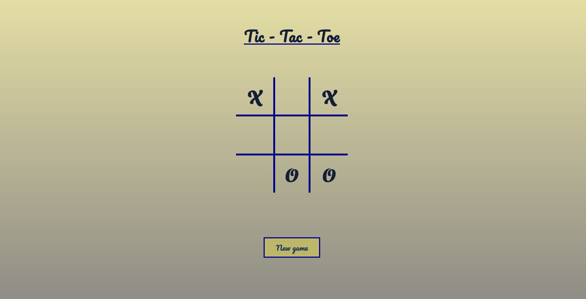

# Tic Tac Toe

A [Tic-tac-toe)(https://en.wikipedia.org/wiki/Tic-tac-toe) game for the JavaScript curriculum at [The Odin Project](https://www.theodinproject.com). One can play against another human in hot seat mode or against an AI that chooses random legal fields. The goal here was to practice organizing one's code via factory functions and the module pattern (using IIFE's).

## Reflection

- It was quite fun to work with factories/IIFE's. I'm not sure I got everything right structure-wise, but I feel quite content. Once you have your building-blocks (functions) it becomes relatively easy and straightforward to expand functionality.

## Demo

[View it here](https://reinimax.github.io/tic-tac-toe/)
